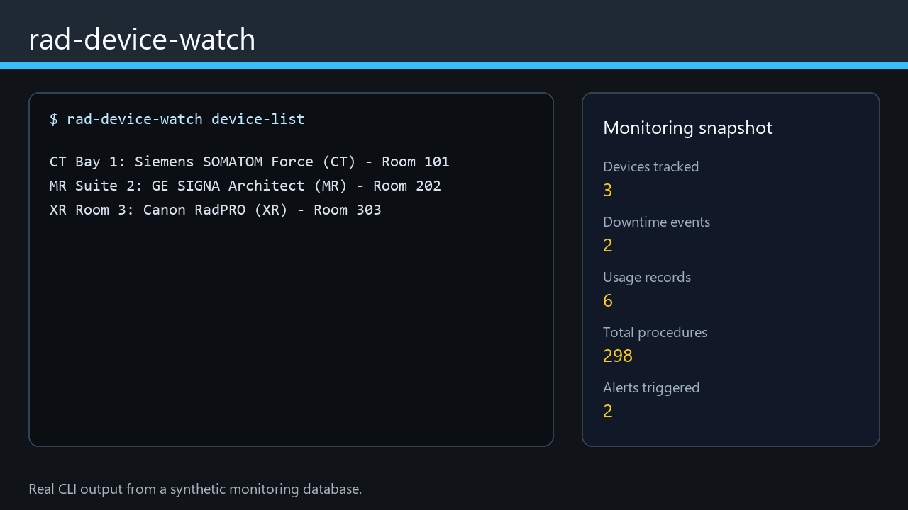

# rad-device-watch

[](https://github.com/AKaturu/rad-device-watch/actions/workflows/ci.yml)
[](https://www.python.org/)
[](LICENSE)
[](https://github.com/astral-sh/ruff)

**Radiology device monitoring for inventory, uptime/downtime, usage auditing, and proactive alerting.**

[](https://cdn.jsdelivr.net/gh/AKaturu/rad-device-watch@main/docs/assets/demo.mp4)

[Play the full demo video](https://cdn.jsdelivr.net/gh/AKaturu/rad-device-watch@main/docs/assets/demo.mp4)

`rad-device-watch` helps radiology teams track imaging-device inventory, monitor availability, audit procedure volumes, and alert when device metrics cross configurable thresholds. It supports manual entry, CSV/Excel import, DICOM file extraction, HL7 v2 message parsing, DICOM MPPS-oriented polling, CSV export, and a Streamlit dashboard.

## Evidence Status

| Evidence | Status |
|---|---|
| Unit and integration tests | Complete |
| Synthetic end-to-end evaluation | Complete |
| Public-data evaluation | Not completed |
| Independent expert review | Not completed |
| Institutional validation | Not completed |
| Prospective clinical validation | Not completed |

This software is a research prototype and is not intended for independent clinical decision-making.

## Quick Start

```bash
git clone https://github.com/AKaturu/rad-device-watch.git
cd rad-device-watch
python -m pip install -e ".[app]"
rad-device-watch init
rad-device-watch device-add "CT1" --manufacturer Siemens --modality CT
rad-device-watch uptime 2026-01-01 2026-06-30
rad-device-watch serve
```

## What It Does

- Device inventory: track name, manufacturer, model, serial number, modality, location, software version, and status.
- Uptime and downtime: log downtime events with cause and impact level, then compute uptime percentage for any period.
- Usage auditing: record procedure volumes per device and summarize usage across a date range.
- Alerting: configure rules on downtime duration, uptime percentage, or usage volume.
- Data sources: manual entry, CSV/Excel import, DICOM file device-module extraction, HL7 v2 messages, and DICOM MPPS-oriented polling.
- Reporting: rich console tables, plain-text summaries, and CSV export.
- Dashboard: interactive Streamlit web UI for monitoring and management.

## CLI Commands

| Command | Description |
|---|---|
| `rad-device-watch init` | Initialize the database schema. |
| `rad-device-watch device-add` | Register a new device. |
| `rad-device-watch device-update <id>` | Update selected device fields. |
| `rad-device-watch device-list` | List all devices. |
| `rad-device-watch device-get <id>` | Show device details. |
| `rad-device-watch device-delete <id>` | Remove a device. |
| `rad-device-watch import-cmd` | Import devices, downtime, or usage from CSV/Excel. |
| `rad-device-watch import-dicom <path>` | Extract device info from DICOM files. |
| `rad-device-watch downtime-log` | Log a downtime event. |
| `rad-device-watch downtime-list` | List downtime events. |
| `rad-device-watch downtime-delete <id>` | Delete a downtime event. |
| `rad-device-watch uptime <start> <end>` | Compute uptime percentage for devices. |
| `rad-device-watch usage-add` | Record a usage entry. |
| `rad-device-watch usage-report <start> <end>` | Generate a usage summary report. |
| `rad-device-watch maintenance-add` | Add a maintenance record. |
| `rad-device-watch maintenance-list` | List maintenance records. |
| `rad-device-watch maintenance-complete <id>` | Mark maintenance complete. |
| `rad-device-watch maintenance-delete <id>` | Delete a maintenance record. |
| `rad-device-watch alert-add` | Create an alert rule. |
| `rad-device-watch alert-check` | Evaluate all alert rules. |
| `rad-device-watch alert-history` | View triggered alerts. |
| `rad-device-watch alert-acknowledge <id>` | Acknowledge a triggered alert. |
| `rad-device-watch alert-delete <id>` | Delete an alert rule. |
| `rad-device-watch export <output_dir>` | Export data to CSV. |
| `rad-device-watch serve` | Launch the Streamlit dashboard. |

## Alert Rules

Rules are evaluated periodically and can trigger on any combination of device and metric:

| Metric | Condition | Description |
|---|---|---|
| `downtime_duration` | `gt`, `lt`, `eq` | Total downtime in minutes in the last 7 days. |
| `uptime_pct` | `gt`, `lt`, `eq` | Uptime percentage in the last 7 days. |
| `usage_volume` | `gt`, `lt`, `eq` | Total procedure count in the last 7 days. |

Supported alert channels: `console`, `email`, `slack`, and `webhook`.

SMTP passwords are never stored in SQLite. Put the password in an environment
variable and reference its name in the email channel configuration:

```bash
export RAD_DEVICE_WATCH_SMTP_PASSWORD="..."
rad-device-watch alert-add "Email ops" \
  --metric uptime_pct --condition lt --threshold 95 --channel email \
  --config '{"smtp_server":"smtp.example.org","username":"alerts","password_env":"RAD_DEVICE_WATCH_SMTP_PASSWORD","recipients":["ops@example.org"]}'
```

## Demo Media

The README animation is generated from real CLI commands against a synthetic SQLite monitoring database:

```bash
python -m pip install -e ".[media]"
python scripts/generate_demo_media.py
```

See [docs/demo-media.md](docs/demo-media.md) for details.

## Import Formats

### CSV / Excel

```csv
name,manufacturer,model,serial_number,modality,location
CT1,Siemens,SOMATOM Go.Up,SN12345,CT,Room 101
MR1,GE,SIGNA Architect,SN67890,MR,Room 202
```

### DICOM

Extracts device module tags such as manufacturer, station name, model, serial number, software version, and install date from single files or directories.

### HL7 v2

Parses ORM, ORU, MDM, and ADT messages using `hl7apy`, extracting device information and procedure data from OBR, OBX, PID, and Z-segments.

HL7 usage and MPPS records require a station-name resolver and are skipped when
the station is unknown; integrations can pass `DeviceManager(db).resolve_id` to
`extract_usage_from_hl7(..., resolve_device_id=...)` or `MppsPoller(device_resolver=...)`.

## Safety And Scope

This tool is intended for operations analytics, quality improvement, and workflow prototyping. Validate importer mappings and alert thresholds before using outputs in production workflows.

## License

MIT. See [LICENSE](LICENSE).
